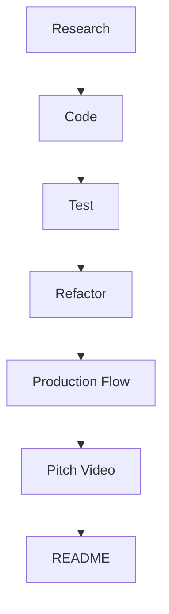

# Whisper Streaming

I will document all the things I have learned here

## DISCOVERIES

Topics summary

**Frontend**
- VAD JS
- Buffers, Blob, Base64
- Fetch API
- Media Recorder API
- VueJS

**Server**
- Whisper 
- Faster Whisper
- Numpy
- Batch Processing
- Asyncio
- Aiohttp

## TODO

## FEATURES

Make this later
